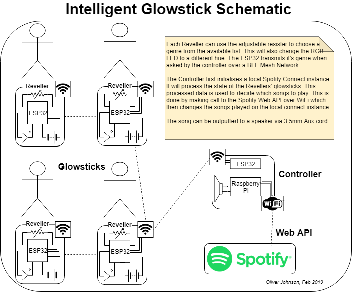

# iot-stick
Decide on what set to play by wearing a Glowstick, powered by ESP Mesh. 

### Use Case
Give everyone at a party or club one of these glowsticks. On each glowstick is a knob to select what genre they're feeling. Each of these glowsticks are networked via ESP Mesh. The controller or `Root` node takes a snapshot and uses that data to communicate with the Spotify API to give reccomendations and then automatically play them.

### Overview

As you can see there are two moving parts in the system. The glowstick and the controller.
  1. The Glowstick -> The part that has all the LEDs connected and that you wear around your neck
  2. The Controller ->  The part that collects all the data and then chooses which songs to play

## Bill of Materials

The descriptions in parenthesis are what we used to build/develop the system.

__Controller__

The controller makes use of an ESP32 as its root node which has a UART connection to talk to a Raspberry Pi which then does all the API interactions

  - Raspberry Pi (3B+)
  - A power source (USB to Micro-USB)
  - HDMI Cable to connect Pi to screen
  - A screen
  - USB Mouse & Keyboard
  - A connection to a sound system (3.5mm Aux cord)
  - 3 wires with Male-Female headers

  - An ESP32 board (ESP DevKit-C)
  - A power source (USB to Micro-USB)

__A Glowstick Node__

ESP-Mesh supports up to [1000 nodes](https://www.espressif.com/en/products/software/esp-mesh/overview). But to get your party started here are the materials needed for one individual node:
  - ESP32 (ESP DevKit-C)
  - A power source (USB Powerpack)
  - ?
  - ?
  - ?

## Installation Instructions
Individual instructions on how to install and wire pieces together can be found in the `mesh` and `player` folders. It also outlines the software environment needed to develop 

## Development History
Take a look at [Oliver's](https://cs.anu.edu.au/courses/china-study-tour/news/#oliver-johnson) and [David's](https://cs.anu.edu.au/courses/china-study-tour/news/#david-horsley) blogs. However we do want to point out some of the architectuaral and design choices we've made.

#### ESP-IDF over Arduino

#### ESP-Mesh over BLE Mesh

## If you're stuck...
We're very happy to help you out as much as possible, but the best thing that you can do is have a look at some of the resources that we used to develop the system:
  - [Neil Kolban's Book on ESP32](https://leanpub.com/kolban-ESP32)
  - [Espressif IoT Development Framework](https://github.com/espressif/esp-idf) and associated [docs](https://docs.espressif.com/projects/esp-idf/en/latest/)
  - [Espressif Mesh Development Framework](https://github.com/espressif/esp-mdf) and associated [docs](https://docs.espressif.com/projects/esp-mdf/en/latest/index.html)
  - [Spotify API Guides](https://developer.spotify.com/documentation/web-api/)
  - [Spotify Python Framework, spotipy](https://github.com/plamere/spotipy)
  - [Librespot](https://github.com/librespot-org/librespot)

You can also contact us through email and we'll try to get back to you:
Oliver: u6406755(at)anu.edu.au
David:  u6(at)anu.edu.au