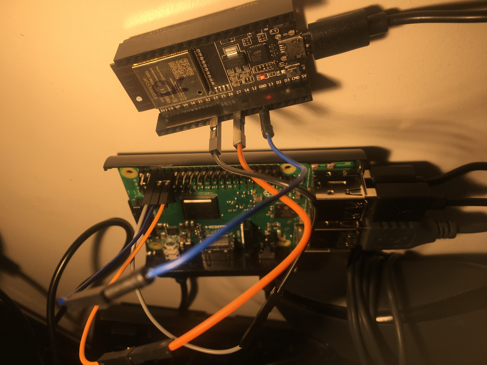

# controller
The controller has both the ESP-Mesh Root node (to collect the packets from the network), and the Raspberry Pi to interact with the Spotify API.

## Environment
You need python 3, running on a Raspberry Pi to be able to run the selection code. Here are some useful links to get you started. NOOBS (Debian) comes with Python3 pre-installed and is what we used. [Instructions here.](https://www.raspberrypi.org/documentation/installation/noobs.md)

If you want to develop the code further also consider putting python on your local machine.

The scripts are also dependent on the _spotipy_ python framework. To install it on the Pi call the following command or go it its [github repo](https://github.com/plamere/spotipy).

```
pip install spotipy
```

We also use [Raspotify](https://github.com/dtcooper/raspotify) to create a local spotify connect node. It requires a Spotify Premium account. This allows Spotify to stream music directly to the Pi, which we can then manipulate via API. To install call the following instructions on the Pi.

```
curl -sL https://dtcooper.github.io/raspotify/install.sh | sh
```

## Hardware

To read the node the Pi uses a UART serial connection to communicate to the ESP32. Plug the wires in according to the following diagram:




Pi Pin | ESP32 Pin
------------ | -------------
GND (6) | GND (Any)
Tx (8) | Pin 27
Rx (10) | Pin 33

To check that a serial connection has been established use the util script `serial_read_network.py`

## On the Pi

To setup the Pi to run first call librespot with the following flags
```
librespot -n "Pi Radio" -u "<your spotify username>" -p "<your spotify password>"
```

Then call the selection algorithm.
```
python3 selection.py
```

The first time you call it with a new username it will redirect you to a spotify permissions page. After logging in with your credentials copy the web address and enter it into the terminal as prompted.

Unless you delete your cache, or use another username you should not have to log in again, instead using your Refresh Token to be granted another Access Token.

## On the ESP32

You will have to load the mesh code onto the ESP32 connected to the Pi aswell. Have a look at the [instructions](../glowstick/README.md) under glowstick on how to setup the environement and get the code. Before uploading the code make sure to do the following things:

```
make menuconfig
```
Then navigate to `Example Configuration` and `Configure Device Type` to `Root Node`
```
make flash monitor
```

Wait for it to flash and check that you can see the Mesh has been initiated. Once a non-root node has been connected you should see the monitor record its packets, and the `serial_read_network.py` tool should start to receive genres.

## Issues

At the moment the network read file only knows eight genres. If you are incresing the number of genres on the glowsticks make sure to increase the number in `serial_read.py`

Be aware that Raspotify and Librespot are unofficial APIs and will often break if Spotify makes any changes to their code. For example we were struck with a [serious issue](https://github.com/librespot-org/librespot/issues/288) only 24 hours before we presented.

If something isn't working check in your Spotify App if you can see _"Pi Radio"_ in your _"Other Devices"_ screen. If you do Raspotify is working, if you don't check to see if a new playlist _"IoT Reccomends ..."_ has been created. If you see it then you know Raspotify is not working but the selection script is.

Anything else, give us a hoot via email on the main README. Or raise an issue.