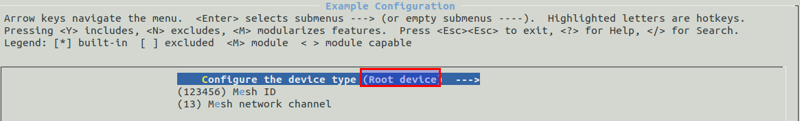

# mesh-node
The code we used as a template was taken from the esp-mdf [get-started example](https://github.com/espressif/esp-mdf/tree/master/examples/get-started). Take a look at their example to get an understanding of the foundation that we developed from.

It introduces a quick way to build an ESP-MESH network without a router. For another detailed network configuration method, please refer to [examples/function_demo/mwifi](../function_demo/mwifi/README.md). Before running the example, please read the documents [README](../../README_en.md) and [ESP-MESH](https://docs.espressif.com/projects/esp-idf/en/latest/api-guides/mesh.html).

Each glowstick is one of these Mesh Nodes. It has a genre associated with it that can be changed via a selector switch.

## Hardware

To build one Glowstick node you need:
- ?
- ?
- ?

Wired according the the following diagram.

Note that if you are using different GPIO pins to connect to the board or your board is not the ESP32 DevKit-C, the wiring digram may be different.

## ESP Mesh

There are two types of nodes in an ESP-Mesh Network

- Root node: There is only one root node in an ESP-MESH network. `MESH` networks can be differentiated by their `MESH_ID` and channels.
- Non-root node: Include leaf nodes and intermediate nodes, which automatically select their parent nodes according to the network conditions.

This node uses ESP-MDF. To install the environemnt follow the instructions [here](https://docs.espressif.com/projects/esp-mdf/en/latest/get-started/).

When this is completed you need to go to the submenu `Example Configuration` and configure the device as a `non-root node` with `make menuconfig`. You can also go to the submenu `Component config -> MDF Mwifi`, and configure the ESP-MESH related parameters like max number of layers, the number of the connected devices on each layer, the broadcast interval, etc.

One must be configured as a root node and this is the ESP32 used as part of the controller

## Run

1. Set the event callback function; 
2. Initialize wifi, and start ESP-MESH;
3. Create an event handler function:
	- Non-root nodes send the genre type to the root node at an interval of 1.5 seconds, and wait for its reply;
	- The root node replies with an ack when it receives the data.
4. Create a timer: print at the specified time the ESP-MESH network information about layers, the signal strength and the remaining memory of the parent node.
5. A series of interrupt handlers that fire when a rising edge is detected on any of the pins connected to the genre selector:
	- When detected the LEDs change colour
	- When detected the genre number is updated

## Issues

On Windows you may have troubles with the USB drivers. To troubleshoot this download the [UXC View Tool](https://www.silabs.com/community/interface/knowledge-base.entry.html/2006/01/20/cp210x_troubleshooti-Ej23) and check the outputs of your ports. It may be that your cable's data line is broken.

